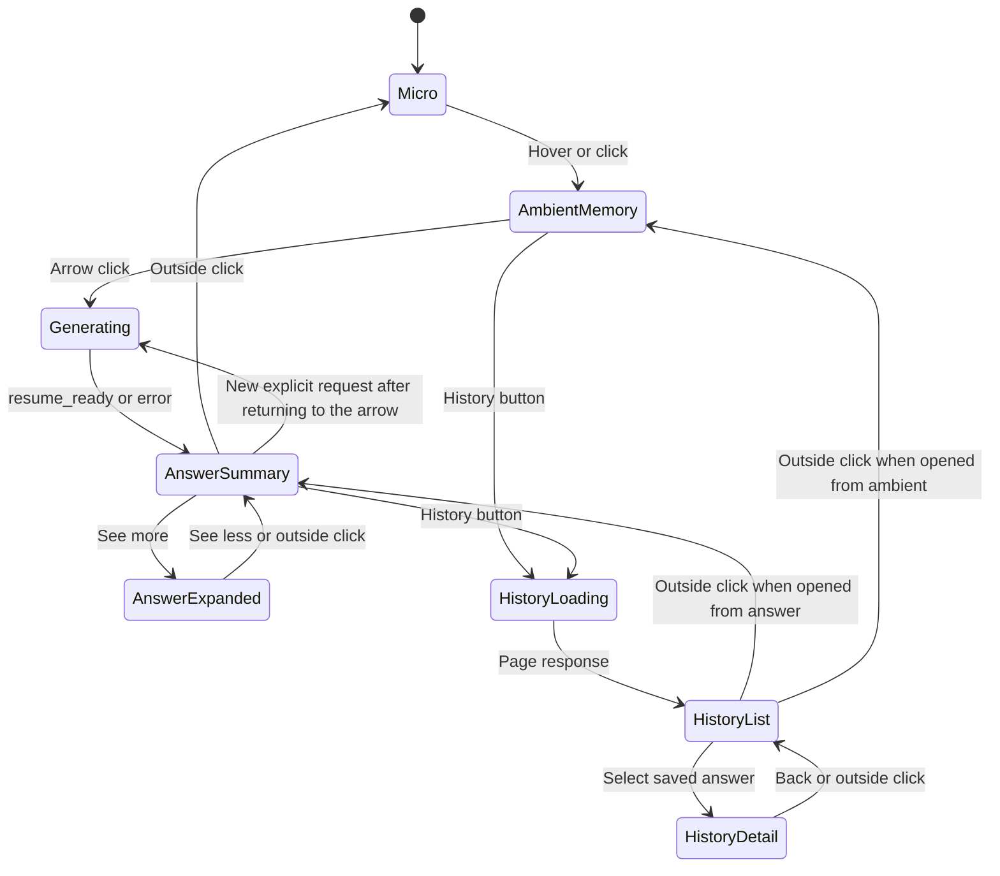

# Current Native Island UI/UX

**Status:** implementation-accurate description of the working tree on 2026-07-19

**Scope:** native macOS floating island only

**Primary source:** [`src-tauri/macos/SessionIslandPanel.swift`](../src-tauri/macos/SessionIslandPanel.swift)

**Backend contract:** [`src-tauri/src/session_island.rs`](../src-tauri/src/session_island.rs), [`src-tauri/src/session_island/contract.rs`](../src-tauri/src/session_island/contract.rs), and [`src-tauri/src/session_island/gateway.rs`](../src-tauri/src/session_island/gateway.rs)

## 1. Current product behavior

The native island is now connected to the existing Continue backend.

Pressing the right arrow:

1. Immediately enters a request-in-flight state.
2. Removes the arrow action so a second request cannot be dispatched concurrently.
3. Shows `Generating answer…` with a clockwise chasing-dot matrix.
4. Dispatches the existing native `continue` action to Rust.
5. Keeps generating through the backend's `trail_reconstructing` snapshot and unrelated capture/status snapshots.
6. Latches the terminal `island_continue_state` and its decision ID when Rust returns `resume_ready` or `error`.
7. Shows the exact non-empty `semantic_answer.product_projection.primary_instruction` as the compact title.

There is no separate preview answer, summarizer, model prompt, response schema, or presentation-specific fallback based on the current application or window. The React interface is not involved.

The island still does not change strict target-opening behavior, feedback actions, capture commands, semantic authority, or backend generation policy in this presentation pass.

## 2. Native panel and placement

The island is SwiftUI hosted inside an AppKit `NSPanel`. It is not part of the main Tauri webview.

The panel is:

- Borderless and nonactivating.
- Transparent, without an AppKit window shadow.
- Floating above normal windows and available across Spaces and full-screen apps.
- Kept visible while Smalltalk is inactive.
- Movable by dragging its background.
- Marked with AppKit's read-only window-sharing mode.

The first placement is near the top center of the screen containing the pointer. Size changes preserve the panel's top-center anchor, so generating, compact, and expanded states grow downward and outward from the same location. The final panel frame is clamped to the usable screen frame.

## 3. Presentation states

The native presentation enum has eight states:

```swift
private enum WhisperFlowPresentation: Equatable {
    case micro
    case ambientMemory
    case generating
    case answerSummary
    case answerExpanded
    case historyLoading
    case historyList
    case historyDetail
}
```



The completed answer has no automatic timeout. It remains latched while capture and status snapshots continue. Only dismissal or a new explicit Continue request changes the visible answer.

## 4. Ambient memory and arrow action

At rest, the island is micro-first. Hovering or clicking reveals the ambient-memory pill.

The ambient pill continues to use the existing truthful capture states and capture behavior. Its right arrow has the accessibility label `Show what I was doing`.

The arrow calls `requestContinue()`. That method sets request-in-flight state before dispatching `sendAction("continue")`. While the request is active, the arrow is replaced with a clear, noninteractive region. The controller guard also rejects any repeated invocation.

The arrow does not start or stop capture and does not open a target.

## 5. Generating state

Generation feedback is visible immediately, before Rust publishes its first request snapshot.

The generating island uses the existing notification-size geometry:

- Panel: 255 x 61 points.
- Visible capsule: 236 x 46 points.
- Copy: `Generating answer…`.
- Dot matrix: 13 x 13 points.

The 5 x 5 matrix animates a bright dot clockwise around its perimeter. The animation repeats only while the Continue request is in flight. Any terminal Continue result removes all layer animations immediately.

When Reduce Motion is enabled, the perimeter does not rotate. The matrix displays a static highlighted pattern beside the same generating copy.

Capture lifecycle transitions cannot replace the generating presentation while the request is active.

## 6. Compact answer

The compact answer displays the returned `semantic_answer.product_projection.primary_instruction` verbatim. Swift checks whether the field is empty, but it does not trim, normalize, punctuate, summarize, or reconstruct the displayed value. The backend creates this instruction only from the admitted `next_supported_action`; legacy `task_summary`, `next_action`, and `unfinished_state` fields cannot replace it.

If the backend does not provide a usable instruction, the compact title is an honest typed state. Examples include:

- `I found the task, but not a safe next step.`
- `I couldn’t identify the unfinished task.`
- `The provider couldn’t produce a usable Continue answer.`
- `I couldn’t read the Continue answer.`
- `The Continue answer did not pass validation.`
- `The saved answer is older than the latest work.`

Application names, window titles, current-focus labels, activity summaries, and remembered local UI copy are not used as answer substitutes.

### Compact geometry

- Visible capsule height: exactly 30 points.
- AppKit panel height: exactly 49 points.
- Minimum visible width: 152 points.
- Width is measured from the exact title, `See more`, spacing, and horizontal padding.
- The panel grows horizontally up to the usable screen boundary.
- The visible title stays on one line. It is visually clipped at the boundary only when the screen cannot fit its measured width.
- VoiceOver receives the full unmodified title followed by `See more`, even when the visual line is clipped.

The summary has no eight-second timer and does not change on hover. `See more` opens the expanded answer. An outside click dismisses the summary back to the micro state.

## 7. Expanded answer

The expanded answer renders only the canonical product projection. Values are passed directly to `Text` without rephrasing or joining.

The order is:

1. Primary instruction.
2. `Where you stopped`, when `resume_context` is present.
3. `Location`, when `location_context` is present.
4. The typed primary action, when the matching island action is enabled.
5. `Inspect`, when aligned evidence or diagnostics are available.

The typed action is `open_direct_target`, `inspect_evidence`, `refresh_continue`, or `none`. Swift routes it through the existing enabled island action. It cannot manufacture an open action from a frame preview or legacy target field. Confidence, evidence identifiers, support slots, admission diagnostics, recent context, and compatibility fields stay outside this canonical first-screen branch.

### Content-driven geometry

The controller measures the exact strings with the same system-font sizes used by the rendered view.

- Width range: 320 to 640 points.
- Minimum height: 104 points.
- Maximum height: 70% of the usable screen height.
- Horizontal padding: 24 points.
- Vertical padding: 20 points.
- Corner radius: 24 points.

Short output therefore produces a small card. Longer output increases the width and natural height. If the measured content exceeds the height limit, the complete task summary and all semantic rows remain inside a vertical scroll view. Text values are not truncated or rewritten.

The material remains black with the existing dark outline and pink field/action labels. `See less` returns to the compact summary. The first outside click from the expanded result also returns to the summary; it does not dismiss both levels at once.

### Answer-linked visual cue

`See more` initially opens only the answer card. When the terminal semantic answer references a safe local evidence frame and the image decodes successfully, the answer header adds a compact `Visual cue` button. The screenshot remains hidden until the user explicitly selects that button.

Selecting `Visual cue` attaches the screenshot card eight points below the answer card. Selecting the same control again hides it. Both surfaces remain inside the same native panel and therefore move, collapse, and preserve the top-center anchor together. `See less` and an outside click also hide the cue before the next expansion.

Rust resolves only `semantic_answer.evidence_preview.frame_id` from that answer. The frame must:

- Belong to the session in the semantic answer's atomic identity.
- Have the exact privacy status `normal`.
- Resolve to a readable file inside Smalltalk's capture directory.

The cue prefers that frame's `full_screenshot_path`. It uses the same frame's `snapshot_path` only when the full-display path is absent. A missing, invalid, unreadable, sensitive, or cross-session frame produces no visual card. The system never substitutes the latest frame, an active-window crop, or a new screenshot.

The attached card uses:

- The exact title `Visual cue` in 11-point semibold pink text.
- The same black material and `#30302F` outline.
- An 18-point card radius and 12-point inner padding.
- Eight points between the title and image.
- A 12-point image radius.
- Aspect-fit rendering of the full screenshot, with no cropping.
- An image viewport capped at 220 points high.

The optional card uses the same 320–640-point content-driven width as the answer. While hidden, it contributes no height to the expanded island. While visible, the whole stack stays within 70% of the usable screen height. When space is constrained, the screenshot viewport shrinks before the upper answer card is allowed below its existing 104-point minimum. Long answer text scrolls only inside the upper card; the lower cue remains fixed.

The screenshot is read and decoded away from the main thread. A decoding failure silently omits both the button and cue without changing the answer. Clicking the button uses a short opacity entrance while the existing 180 ms top-anchored panel morph makes room. Reduce Motion keeps the state change but removes positional motion.

## 8. Continue history

The medium ambient island and compact current-answer capsule now expose a detached `clock.arrow.circlepath` control. The visible circle is 30 points, its hit target is 40 points, and its visible edge sits eight points from the capsule. It is hidden in micro, generating, expanded current-answer, and capture-transition presentations.

The control normally sits to the left. It moves to the right only when its 40-point hit target would leave the usable screen frame. The control and history content remain inside the existing `NSPanel`; no second window is created. Panel growth preserves the live capsule's top-center anchor.

Opening history shows a card eight points below the live capsule:

- Preferred width: 360 points, clamped to 320–380 points.
- Maximum height: 60% of the usable screen height.
- First page: 25 entries, newest first.
- Retention: the newest 100 unique decision IDs.
- Loading: four restrained skeleton rows.
- Empty: `No previous answers yet` and `Use Continue to create one`.
- Failure: `History unavailable` with a Retry action.
- Pagination: `Load older answers` appears only when the page returns another cursor.

Each row shows the exact saved title, limited to two lines, and a locale-aware relative time. Its tooltip and VoiceOver label contain the full local date and time. The live decision receives a restrained pink `Current` indicator.

Selecting a row opens a read-only detail. It uses the same title, field order, label typography, value typography, and spacing as the expanded current answer, with `Past answer · <date/time>` and Back. Historical detail does not expose a visual cue, target opening, regeneration, feedback, deletion, search, or export.

The history controller keeps separate state for the live answer and saved detail. Page and detail requests run away from the main thread and carry monotonically increasing request IDs. Swift accepts a response only when its echoed ID matches the active request, so late or unrelated snapshots cannot replace or reopen the history surface.

Dismissal is one level at a time: detail returns to list, list returns to the originating ambient or compact-answer state, and the normal island behavior can then return to micro. Pressing the history button while history is open closes the whole history surface directly. Escape follows the same one-level rule. VoiceOver focus moves to the History heading when opened and returns to the history button when closed.

Dragging remains available from the preserved live capsule while history is open. The history control, card, rows, scrolling region, and scrollbars cannot begin a panel drag.

### Persistence boundary

`continue_answer_history` stores an immutable version-1 product output: decision ID, presentation timestamp, origin (`island` or `main_app`), exact canonical instruction, resume context, optional location, action label, answer identity, and ordered visible rows. It stores only final, decision-backed, explicit manual Continue results. Startup and background refreshes are excluded. Duplicate decision IDs keep their first saved copy.

History reads are bounded, read-only SQLite queries. They are internal to the native island bridge and do not add a Tauri command or React interface. Selecting saved history never updates the remembered live decision, current-answer latch, feedback state, strict-open ownership, or visual cue. Delete local memory replaces the local database, which also removes the history table contents.

## 9. Answer latching and snapshot rules

The controller maintains separate internal state for:

- Whether Continue is in flight.
- The latched answer.
- The latched decision ID.
- The latched visual-cue path and decoded image.
- Whether the user has explicitly revealed the cue.
- An asynchronous image-load nonce used to reject stale completions.
- The history origin, page, cursor, selected saved output, errors, and independent page/detail request IDs.
- The measured answer layout.

The state flow is deliberately different from ordinary capture presentation:

- `trail_reconstructing` confirms generation and keeps the spinner active.
- Recording, capture count, privacy, and other status snapshots may update the controller's underlying snapshot, but they cannot replace the generating presentation.
- `resume_ready` or `error` ends the active request and creates the latched answer.
- Later capture/status snapshots do not rebuild the displayed answer from their app, window, or activity fields.
- Later snapshots also cannot replace the answer-linked cue with a newer capture.
- A new arrow request clears the old answer and cue latches before dispatching Continue.

The decision ID is presentation state only. It does not change backend authority or strict target-opening policy.

## 10. Error and unresolved behavior

A backend provider, parser, or validation failure displays its matching canonical failure instruction. An unresolved result without an admitted unfinished task displays `I couldn’t identify the unfinished task.` A known task without an admitted next action displays `I found the task, but not a safe next step.`

The native layer does not fabricate a successful-looking answer from:

- `current_focus`
- `activity_label`
- `activity_summary`
- application name
- window title
- recent context labels

Optional projection fields that are empty are omitted from the expanded card. Existing non-empty values are preserved exactly.

## 11. Motion and accessibility

The normal panel morph remains 180 ms and top-anchored. The generating chase uses Core Animation and stops when status leaves `generating`.

History list/detail changes use a 140 ms opacity and 0.97-scale transition without bounce or stagger.

Reduce Motion behavior:

- No rotating generating chase.
- Static highlighted matrix while generation is active.
- Immediate or opacity-only presentation changes where existing island behavior already requires it.
- Opacity-only history transitions.
- No change to the displayed text.

VoiceOver behavior:

- The generating pill exposes `Generating answer…` through the status text.
- The matrix remains decorative and hidden from accessibility.
- The compact answer announces the full title and `See more`.
- The expanded answer exposes the title, each field label, each exact field value, and `See less`.
- A decoded safe screenshot exposes a `Visual cue` button whose label announces whether it will show or hide the cue.
- The cue card exposes `Visual cue`, and the image is described as `Full-screen evidence used for this answer`.
- The history control is labeled and tooled as `Continue history`.
- Each history row announces its exact title, full local timestamp, and current or past state.
- Opening history focuses the History heading; closing it returns focus to the history control.

## 12. Outside click, dismissal, and persistence

Outside-click monitors exist for compact answers, expanded answers, and open history.

- Compact answer plus outside click: return to micro.
- Expanded answer plus outside click: return to compact answer.
- Historical detail plus outside click: return to history list.
- History list/loading plus outside click: restore the exact originating ambient or compact-answer presentation.
- History button while history is open: close the whole history surface directly.
- `See less`: return to compact answer.
- `Visual cue`: toggle the optional screenshot card without changing the answer.
- Click inside the panel: do nothing in the outside-click handler.

There is no answer reveal timer and no answer return timer. Dismissing the presentation does not mutate the backend answer. Starting another explicit Continue request is the only path that clears the old latch for replacement.

## 13. Shared interface and intentionally unchanged behavior

`TaskTruthPublicAnswerV1` now includes the versioned `smalltalk.continue_product_projection.v1` object. `IslandContinueState` carries that answer unchanged. React and Swift both consume the same instruction, context, semantic/task/target states, action kind, action label, and answer identity. The projection is recomputed after admission, correction, forced unresolved sanitization, target attachment, and stale-decision transitions.

This presentation contract does not change:

- Tauri command names.
- Rust gateway dispatch.
- Strict decision-ID target opening.
- Feedback buttons or correction behavior.
- Capture commands or capture privacy behavior.
- Visual-cue ownership and privacy validation.
- Read-only history selection.

The optional snapshot fields `SessionIslandSnapshot.visual_cue`, `continue_history_page`, and `continue_history_output` remain internal to the native bridge. The cue contains a validated local image path. History responses contain only saved canonical product copy plus pagination and request identity.

The incomplete PFTU release verdict is also unchanged. Connecting the island to the backend output is not a release-readiness claim.

## 14. Size reference

| Element or behavior | Current value |
| --- | ---: |
| Micro/capture panel | 187 x 49 pt |
| Generating panel | 255 x 61 pt |
| Generating visible pill | 236 x 46 pt |
| Compact visible height | 30 pt |
| Compact panel height | 49 pt |
| Compact minimum visible width | 152 pt |
| Expanded width | 320–640 pt |
| Expanded minimum height | 104 pt |
| Expanded maximum height | 70% of usable screen |
| Expanded corner radius | 24 pt |
| Answer-to-cue gap | 8 pt |
| Visual-cue card radius | 18 pt |
| Visual-cue image maximum height | 220 pt |
| Visual-cue image radius | 12 pt |
| History control | 30 pt visual / 40 pt hit target |
| History visual gap | 8 pt |
| History card width | 320–380 pt; 360 pt preferred |
| History card maximum height | 60% of usable screen |
| History page size | 25 entries |
| History retention | 100 unique decisions |
| History list/detail transition | 0.14 s |
| Generating chase | 0.82 s per loop |
| Main morph/frame duration | 0.18 s |
| Drag threshold | 4 pt |

All dimensions are multiplied by `gOverlayScale`, currently `1.0`.

## 15. Verification contract

The Rust source-contract test now checks the native file for:

- Real `continue` dispatch.
- Concurrent-request prevention.
- Generating state and Reduced Motion behavior.
- Terminal answer latching and decision-ID storage.
- Same-session, normal-privacy, capture-root-bounded visual-cue resolution.
- Full-display preference with same-frame snapshot fallback only when the full path is absent.
- Asynchronous cue decoding with decision, path, and load-nonce stale-result guards.
- Explicit visual-cue button disclosure; the screenshot card contributes no height before that click.
- Exact semantic-field order.
- Absence of application/window/activity fallback construction.
- Fixed compact height and adaptive compact width.
- Content-measured expanded width and height.
- Complete scrollable expanded output.
- A fixed attached visual-cue card below the independently scrolling answer.
- The 70% combined-stack height cap, 220-point image cap, and 104-point answer minimum.
- Persistent results without reveal or auto-return timers.
- Top-center panel anchoring.
- One-panel history rendering and detached-control visibility rules.
- History action encoding, cursor pagination, request-ID response latching, and stale-response rejection.
- Exact saved-title rows, empty/loading/error/retry/detail states, full timestamps, and current-decision indication.
- Read-only history behavior with no target dispatch, feedback mutation, regeneration, or historical visual cue.
- History drag exclusion, side flipping, one-level dismissal, VoiceOver focus restoration, and Reduce Motion.

Runtime visual verification still needs both a short backend answer and a deliberately long backend answer because source tests and type-checking cannot prove final screen appearance.

## 2026-07-19 LCA-06 freshness correction

The island no longer infers a stale answer from newer frame, event, signal, or capture timestamps. It consumes the backend-owned `decision_stale` state, whose identity is based on material Continue evidence. The same decision may update from current to stale when that material watermark advances, but a weaker background answer still cannot replace the latched manual answer.

Target availability remains separate from the instruction. A preview-only or suppressed target changes the action to View or Inspect and preserves useful semantic copy. Only a genuinely stale decision shows Refresh Continue and disables direct open. Capture-specific manual-boundary failure has retryable copy. Geometry, motion, capture controls, visual-cue behavior, and read-only history layout are unchanged by LCA-06.
