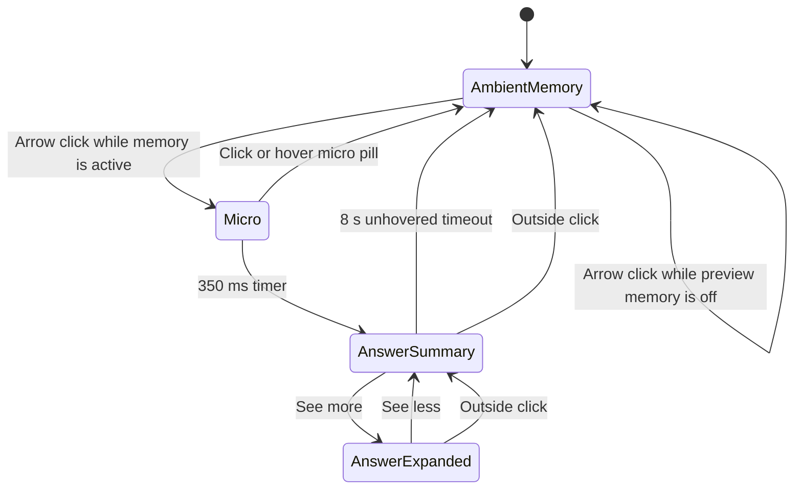

# Current Native Island UI/UX

**Status:** implementation-accurate description of the current working tree on 2026-07-18  
**Scope:** the native macOS floating island only  
**Primary source:** [`src-tauri/macos/SessionIslandPanel.swift`](../src-tauri/macos/SessionIslandPanel.swift)  
**Backend contract:** [`src-tauri/src/session_island.rs`](../src-tauri/src/session_island.rs), [`src-tauri/src/session_island/contract.rs`](../src-tauri/src/session_island/contract.rs), and [`src-tauri/src/session_island/gateway.rs`](../src-tauri/src/session_island/gateway.rs)

## 1. The most important current truth

The island currently behaves as a **UI-only visual prototype**.

It is not yet the real Continue surface, even though the Rust backend behind it still supports capture, Continue generation, typed Continue actions, evidence inspection, and strict target opening.

What the visible Swift UI does today:

- Shows an ambient-memory pill with a dot-matrix animation and rotating status phrases.
- Changes its copy to `What was I doing?` while the pill is hovered.
- Uses the right arrow to run a local preview sequence.
- Briefly shrinks to a micro pill, then shows a fixed answer summary.
- Expands the fixed answer summary into a fixed, larger answer card.
- Returns from the summary to the ambient-memory pill after an idle delay.

What it does **not** do today:

- It does not display the current task, current activity, return target, or next action received from Rust.
- It does not request a new Continue answer when the arrow is pressed.
- It does not start or stop local memory when the arrow is pressed.
- It does not open a Continue target.
- It does not dispatch any of the typed actions exposed in `island_continue_state.available_actions`.
- It does not show an error, privacy, thin-evidence, stale-answer, or no-target state in its visible copy.

This distinction matters because the file still contains backend-aware snapshot decoding and action-routing methods. Those methods are present, but the current visible SwiftUI controls do not call them.

## 2. Where the island lives

The island is a native macOS surface built with SwiftUI inside an AppKit `NSPanel`. It is not rendered by React and is not part of the main Tauri webview.

The panel is configured as:

- Borderless.
- Nonactivating, so interacting with it does not behave like opening a normal app window.
- Floating at two levels above the standard floating-window level.
- Visible across Spaces.
- Allowed alongside full-screen apps.
- Transparent and without an AppKit window shadow.
- Kept visible when Smalltalk is not the active app.
- Movable by dragging its background.
- Marked with AppKit's read-only window-sharing mode.

The island requires macOS 13 or later. The exported bridge functions safely do nothing on older versions because the controller is only created inside the macOS 13 availability check.

## 3. Positioning and drag behavior

On first placement, the island appears near the top center of the screen containing the mouse pointer. If that screen cannot be found, it falls back to the main screen and then the first available screen.

The initial top anchor is:

- Horizontally centered on the physical screen frame.
- Four points below the top of the screen's visible frame.

When the island changes size, it preserves its current top-center anchor. This means the larger answer card grows downward and outward from the same top-center point instead of jumping to a new center.

The final frame is clamped inside the screen's visible frame. The island therefore cannot intentionally grow beyond the usable screen bounds.

Dragging works after the pointer moves more than four points while the mouse button is down. Starting a drag cancels the pending 350 ms answer-reveal timer. The panel then uses native macOS window dragging.

## 4. The four presentation states

The Swift presentation enum has four states:

```swift
private enum WhisperFlowPresentation: Equatable {
    case micro
    case ambientMemory
    case answerSummary
    case answerExpanded
}
```

The normal visible state is `ambientMemory`. `micro` is currently a short transition state in the answer-preview sequence, not the normal idle state.



An edge case is worth noting: clicking or hovering the micro pill returns it to `ambientMemory`, but that action does not cancel the pending answer-reveal timer. Unless a drag cancels the timer, the summary can still appear when the 350 ms timer completes.

## 5. Ambient-memory pill

### Geometry

The AppKit panel is 187 x 49 points. The visible pill is centered inside it and measures 152 x 30 points.

The visible pill contains:

1. A left content area, 107 points wide.
2. A 5 x 5 dot matrix, 11 x 11 points.
3. A status-label area, 92 points wide.
4. Five points of spacing before the right action.
5. A right arrow action, 28 x 24 points.

The pill uses eight points of leading padding and four points of trailing padding.

### Visual treatment

- Background: pure black, `#000000`.
- Outline: dark gray, approximately `#30302F`, one point wide.
- Text: white.
- Shape: capsule.
- No shadow.
- Font: macOS system font, 9.5-point semibold for the status phrase.

The arrow uses the SF Symbol `arrow.right`, at 11-point semibold. It sits in a dark-gray capsule. On hover, that capsule changes from approximately `#30302F` to `#3A3A38`.

The arrow also scales to 96% while pressed, unless Reduce Motion is enabled.

### Status phrases

While the panel is visible, capture indication is active, the pointer is not over the pill, and Reduce Motion is off, the status label rotates through:

1. `Remembering`
2. `Saving context`
3. `Keeping your place`

Each phrase stays for 3.5 seconds. The transition lasts 190 ms. The incoming phrase fades in while moving upward from three points below. The outgoing phrase fades out while moving three points upward.

Hovering anywhere over the ambient-memory pill pauses that carousel and replaces the phrase with:

```text
What was I doing?
```

When the pointer leaves, the carousel resumes from the time remaining in the interrupted 3.5-second interval.

When Reduce Motion is on, the carousel stops and the phrase remains:

```text
Keeping your place
```

### Dot-matrix indicator

The indicator is a 5 x 5 grid of 25 white circular layers.

In its animated form:

- The animation radiates outward from the center using four Manhattan-distance rings.
- One loop lasts 1.6 seconds and repeats indefinitely.
- Resting dot opacity is 15%.
- Peak opacity is strongest at the center and weaker toward the outside.
- Hovering reduces the peak intensity to 78% of its normal value.

With Reduce Motion on, the loop stops. Five dots remain brighter in a plus-sign arrangement centered in the grid.

The dot matrix is hidden from VoiceOver because it is decorative.

### Interaction

Only the right arrow is a button. Hovering the rest of the pill changes the status phrase but does not invoke an action.

The arrow has the accessibility label:

```text
Show what I was doing
```

Its current behavior depends on the controller's local `memoryActive` value:

- If memory is considered active, the arrow begins the answer-preview sequence.
- If memory is not considered active, the first click only sets a local preview override to active. It does not call Rust and does not start capture. A later arrow click can then begin the answer-preview sequence.

Because the ambient visual already looks active, the first click in the inactive case may appear to do nothing.

## 6. Micro pill

The micro presentation uses the same 187 x 49-point panel as the ambient pill.

Inside it:

- Click/hover hit area: 86 x 24 points.
- Visible capsule: 58 x 10 points.
- Background: black.
- Outline: dark gray.

When its pulse is active and Reduce Motion is off, it slowly scales between 100% and 101.8%. Its outline opacity moves between 72% and 100%. A full outward-and-back pulse takes 3.2 seconds.

The micro pill currently appears when an active-memory arrow click begins the answer preview. It lasts for 350 ms before the fixed answer summary appears.

Clicking or hovering the micro pill reveals the ambient-memory pill. Its accessibility label is either `Smalltalk memory is active` or `Show Smalltalk`, based on the local `memoryActive` value.

## 7. Answer summary

The summary uses a 187 x 49-point panel with a centered 152 x 30-point black capsule.

Its content is fixed in Swift:

```text
Island ready. See more
```

Visual treatment:

- `Island ready.` is white.
- `See more` is pink, approximately `#F5BFEF`.
- Both use a 12-point semibold system font.
- The capsule uses the same dark-gray one-point outline as the ambient pill.

`See more` is a button. It expands the island to the full answer card.

The summary starts an eight-second return timer. When the timer expires, the island returns to `ambientMemory`.

Hovering the summary pauses the timer and preserves the remaining duration. Leaving resumes it. Clicking anywhere outside the panel returns directly to `ambientMemory`.

The combined VoiceOver label is:

```text
Island ready. See more
```

## 8. Expanded answer

The expanded answer is a 520 x 152-point black rounded rectangle with a 24-point continuous corner radius and a one-point dark-gray outline.

It uses 24 points of horizontal padding, 20 points of vertical padding, and 18 points between the header and body.

The header contains:

- `Island ready.` on the left.
- `See less` in pink on the right.

The body is fixed preview copy:

> Continue refining the native floating island. Match the micro hover control, compact answer pill, and expanded answer layout to the WhisperFlow references before reconnecting memory or Continue behavior.

The header uses a 12-point semibold system font. The answer uses a 14-point regular system font with three points of additional line spacing.

There is no primary action to open a target, no evidence action, and no displayed task metadata in this view.

`See less` returns to the summary and starts a fresh eight-second summary timer. An outside click also moves from expanded to summary. The first outside click does not skip directly from expanded to ambient.

The expanded card does not have its own automatic return timer.

## 9. Motion and transitions

The main morph duration is 180 ms with the cubic timing curve `(0.23, 1, 0.32, 1)`.

Presentation transitions are:

- `micro`: fade plus scale from 96%.
- `ambientMemory`: fade plus scale from 96%.
- `answerSummary`: opacity only.
- `answerExpanded`: fade plus scale from 97%.

The scale anchor is the top edge. The AppKit panel frame uses the same 180 ms timing when it changes size, so the SwiftUI content morph and native window resize are intended to feel like one motion.

The status phrase has its own 190 ms vertical fade. Button press feedback uses a 140 ms curve.

When macOS Reduce Motion is on:

- Panel-frame resizing is immediate.
- State transitions fall back to opacity or an effectively immediate 10 ms animation.
- The micro pulse stops.
- The dot matrix becomes static.
- The rotating status carousel stops.

## 10. How Rust snapshots affect the visible UI

Rust still sends a detailed `SessionIslandSnapshot` into Swift. Swift decodes capture state, counts, current app/window, Continue decision fields, semantic task state, available actions, freshness, privacy, and errors.

The current visual prototype only uses a small part of that data:

| Snapshot data | Current visible effect |
| --- | --- |
| `state == "hidden"` | Hides the panel. |
| Any non-hidden update | Shows the panel and normally returns it to `ambientMemory`, unless an answer state or the 350 ms reveal timer is active. |
| Recording, starting, or processing state | Makes the controller's real `memoryActive` value true. |
| `frame_count` and `capture_pulse_nonce` | Copied into the Swift observable model, but not rendered by the current dot-matrix UI. |
| Privacy label, `is_sensitive`, error state | Used by the real capture-indication calculation, but the preview flag currently overrides that result before rendering. |
| Continue answer, focus, activity, target, freshness, warnings, and available actions | Decoded but not rendered. |

There is a hard-coded flag:

```swift
private let kWhisperFlowCapturePreviewEnabled = true
```

Because this is `true`:

- The visible capture indication is forced active whenever the panel is visible.
- The model's capture status is forced to `recording`.
- The dot matrix animates even if capture is not actually running.
- The dot matrix can also remain visually active for a sensitive or error snapshot, because the preview flag overrides the privacy-aware capture-indication result.

This is prototype behavior. It must not be interpreted as truthful capture, privacy, or health status.

## 11. Current visible interaction versus the dormant backend contract

The Rust side still supports the following action families:

- Start capture.
- Stop capture.
- Capture once.
- Generate or refresh Continue.
- Open a strict Continue target.
- Inspect evidence in the main Smalltalk window.
- Apply task corrections such as wrong target, not useful, supporting work, unrelated activity, task completion, task reactivation, and alternative-task selection.

Swift also still contains `handle(action:)`, `handle(continueAction:)`, and `sendAction(...)` methods that know how to serialize these actions back to Rust.

However, the visible `WhisperFlowIslandView` is constructed with only five local presentation callbacks:

- Reveal the ambient pill.
- Run the local arrow preview.
- Pause/resume the answer-summary timer on hover.
- Expand the fixed answer.
- Collapse the fixed answer.

No current visible control calls `handle(action:)` or `handle(continueAction:)`. Therefore no visible interaction reaches `sendAction(...)`, and no action callback reaches Rust from this UI.

The backend contract is real but dormant behind the current prototype.

## 12. Update, show, hide, and outside-click behavior

### Snapshot update

For every valid non-hidden JSON snapshot:

1. Swift updates capture metrics and model fields.
2. If the island is not in an answer state and no answer-reveal timer is pending, presentation resets to `ambientMemory`.
3. The panel is initialized if needed.
4. The panel is shown above other windows.
5. Its current top-center anchor is preserved.

If JSON decoding fails, Swift creates an error fallback snapshot. The current visual still shows the ambient preview rather than error copy.

### Hide

Hiding the island:

- Marks the panel invisible.
- Resets presentation to `ambientMemory`.
- Clears the local memory preview override.
- Cancels answer timers.
- Removes outside-click monitors.
- Orders the panel out without destroying it.

### Shutdown

Shutdown additionally releases the panel and hosting-view references so the native surface can be rebuilt later.

### Outside clicks

Global and local mouse monitors are installed only for the summary and expanded answer states.

- Outside click from summary: return to ambient.
- Outside click from expanded: return to summary.
- Clicks inside the panel are ignored by the outside-click logic.

## 13. Accessibility and pointer behavior

- The full panel changes the pointer to the pointing-hand cursor while hovered.
- The panel accepts the first mouse click even when Smalltalk is not active.
- Decorative dot animation is hidden from accessibility.
- The ambient arrow has a specific task-oriented label: `Show what I was doing`.
- The micro pill announces whether local memory is considered active.
- The summary combines its children into one label.
- The expanded answer exposes its child elements, including `See less`.
- Reduce Motion is respected for panel resizing, view morphs, the dot matrix, the status carousel, button press feedback, and the micro pulse.

## 14. Exact size and timing reference

| Element or behavior | Current value |
| --- | ---: |
| Ambient/micro/summary panel | 187 x 49 pt |
| Ambient visible pill | 152 x 30 pt |
| Ambient left content | 107 pt wide |
| Dot matrix | 11 x 11 pt |
| Status label | 92 pt wide |
| Arrow button | 28 x 24 pt |
| Micro hit area | 86 x 24 pt |
| Micro visible capsule | 58 x 10 pt |
| Expanded answer | 520 x 152 pt |
| Expanded corner radius | 24 pt |
| Status phrase interval | 3.5 s |
| Status phrase transition | 0.19 s |
| Dot-matrix loop | 1.6 s |
| Answer reveal delay | 0.35 s |
| Summary return delay | 8.0 s |
| Micro pulse cycle | 3.2 s |
| Micro maximum scale | 1.018 |
| Main morph/frame duration | 0.18 s |
| Drag threshold | 4 pt |

All dimensions are multiplied by `gOverlayScale`, which is currently `1.0`.

## 15. Known implementation mismatches

These are facts about the current working tree, not proposed changes:

1. The current broad document [`docs/current-ui-ux-spec.md`](current-ui-ux-spec.md) describes an older three-state island with an evidence tape and real state-driven copy. That island section is no longer accurate for the present Swift file.
2. The Rust source-level island tests still assert the previous `recordingTape` names, dimensions, timing, and evidence-tape implementation. They have not yet been updated for `ambientMemory` and the dot matrix.
3. The Swift file decodes the truthful Continue contract but renders fixed `WhisperFlowPreview` copy instead.
4. The preview flag forces an active-looking indicator, so the visible status is not reliable evidence that capture is active or privacy-safe.
5. The action-routing code remains in the controller, but the current SwiftUI view has no live route into it.

## 16. Practical user journey today

From a user's point of view, the current sequence is:

1. Smalltalk shows a black ambient pill near the top center of the screen.
2. A small white dot matrix pulses while the copy rotates between ambient-memory phrases.
3. Hover changes the phrase to `What was I doing?`.
4. Pressing the arrow either silently enables the local preview override or, if memory is already considered active, starts the answer preview.
5. The island becomes a tiny capsule for 350 ms.
6. It shows `Island ready. See more`.
7. `See more` opens the fixed 520 x 152-point answer card.
8. `See less` returns to the summary.
9. The summary returns to the ambient pill after eight unhovered seconds.

No step in that visible journey currently generates, displays, or opens a real continuation answer.

## 17. Verification performed for this document

The current native source was checked rather than inferred from the older UI/UX document.

- `cargo check`: passed. This compiles the current Rust backend and the native Swift panel through the Tauri build script.
- `cargo test swift_visual_prototype_has_stable_recorder_motion_contract -- --nocapture`: failed at the expected stale assertion because the test still requires `case recordingTape`, while the current Swift enum uses `case ambientMemory`.
- `git diff --check`: passed.

No live visual test of the running app was performed for this documentation-only task. The behavior above is the exact behavior expressed by the current source and verified build, not a claim about a separately observed runtime session.
