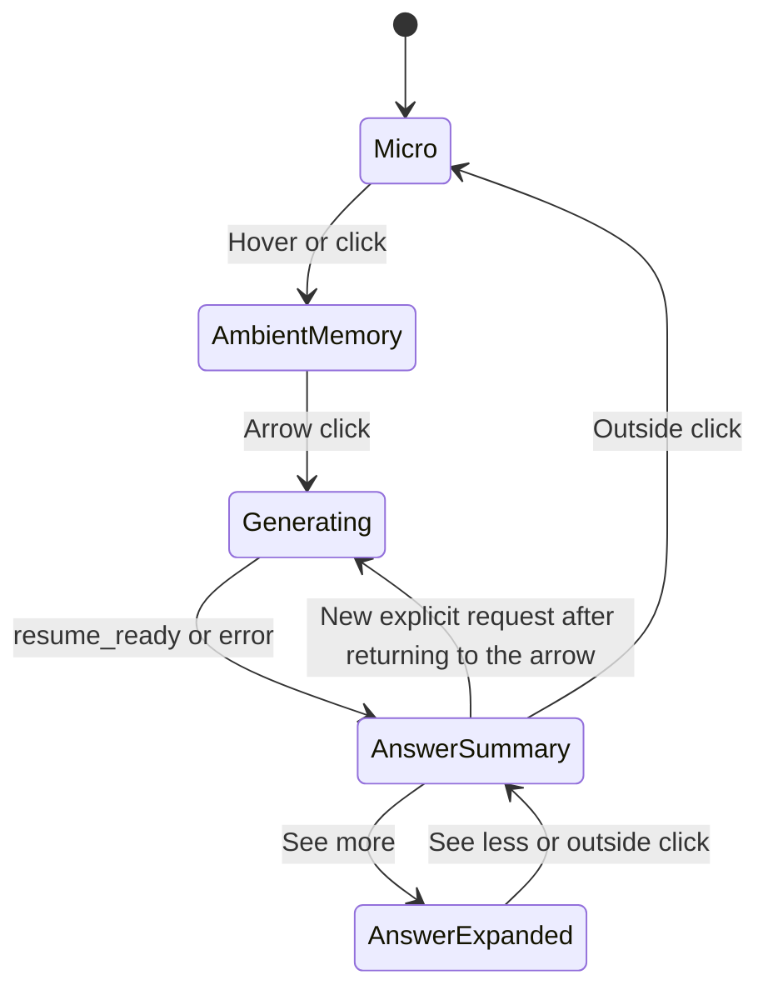

# Current Native Island UI/UX

**Status:** implementation-accurate description of the working tree on 2026-07-19

**Scope:** native macOS floating island only

**Primary source:** [`src-tauri/macos/SessionIslandPanel.swift`](../src-tauri/macos/SessionIslandPanel.swift)

**Backend contract:** [`src-tauri/src/session_island.rs`](../src-tauri/src/session_island.rs), [`src-tauri/src/session_island/contract.rs`](../src-tauri/src/session_island/contract.rs), and [`src-tauri/src/session_island/gateway.rs`](../src-tauri/src/session_island/gateway.rs)

## 1. Current product behavior

The native island is now connected to the existing Continue backend.

Pressing the right arrow:

1. Immediately enters a request-in-flight state.
2. Removes the arrow action so a second request cannot be dispatched concurrently.
3. Shows `Generating answer…` with a clockwise chasing-dot matrix.
4. Dispatches the existing native `continue` action to Rust.
5. Keeps generating through the backend's `trail_reconstructing` snapshot and unrelated capture/status snapshots.
6. Latches the terminal `island_continue_state` and its decision ID when Rust returns `resume_ready` or `error`.
7. Shows the exact non-empty `semantic_answer.task_summary` as the compact title.

There is no separate preview answer, summarizer, model prompt, response schema, or presentation-specific fallback based on the current application or window. The React interface is not involved.

The island still does not change strict target-opening behavior, feedback actions, capture commands, semantic authority, or backend generation policy in this presentation pass.

## 2. Native panel and placement

The island is SwiftUI hosted inside an AppKit `NSPanel`. It is not part of the main Tauri webview.

The panel is:

- Borderless and nonactivating.
- Transparent, without an AppKit window shadow.
- Floating above normal windows and available across Spaces and full-screen apps.
- Kept visible while Smalltalk is inactive.
- Movable by dragging its background.
- Marked with AppKit's read-only window-sharing mode.

The first placement is near the top center of the screen containing the pointer. Size changes preserve the panel's top-center anchor, so generating, compact, and expanded states grow downward and outward from the same location. The final panel frame is clamped to the usable screen frame.

## 3. Presentation states

The native presentation enum has five states:

```swift
private enum WhisperFlowPresentation: Equatable {
    case micro
    case ambientMemory
    case generating
    case answerSummary
    case answerExpanded
}
```



The completed answer has no automatic timeout. It remains latched while capture and status snapshots continue. Only dismissal or a new explicit Continue request changes the visible answer.

## 4. Ambient memory and arrow action

At rest, the island is micro-first. Hovering or clicking reveals the ambient-memory pill.

The ambient pill continues to use the existing truthful capture states and capture behavior. Its right arrow has the accessibility label `Show what I was doing`.

The arrow calls `requestContinue()`. That method sets request-in-flight state before dispatching `sendAction("continue")`. While the request is active, the arrow is replaced with a clear, noninteractive region. The controller guard also rejects any repeated invocation.

The arrow does not start or stop capture and does not open a target.

## 5. Generating state

Generation feedback is visible immediately, before Rust publishes its first request snapshot.

The generating island uses the existing notification-size geometry:

- Panel: 255 x 61 points.
- Visible capsule: 236 x 46 points.
- Copy: `Generating answer…`.
- Dot matrix: 13 x 13 points.

The 5 x 5 matrix animates a bright dot clockwise around its perimeter. The animation repeats only while the Continue request is in flight. Any terminal Continue result removes all layer animations immediately.

When Reduce Motion is enabled, the perimeter does not rotate. The matrix displays a static highlighted pattern beside the same generating copy.

Capture lifecycle transitions cannot replace the generating presentation while the request is active.

## 6. Compact answer

The compact answer displays the returned `semantic_answer.task_summary` verbatim. Swift checks whether the field is empty, but it does not trim, normalize, punctuate, summarize, or reconstruct the displayed value.

If the backend does not provide a usable task summary, the compact title is an honest typed state. Examples include:

- `Couldn’t recover the task`
- `Continue unavailable`
- `Not enough local memory`
- `Continue needs refreshing`

Application names, window titles, current-focus labels, activity summaries, and remembered local UI copy are not used as answer substitutes.

### Compact geometry

- Visible capsule height: exactly 30 points.
- AppKit panel height: exactly 49 points.
- Minimum visible width: 152 points.
- Width is measured from the exact title, `See more`, spacing, and horizontal padding.
- The panel grows horizontally up to the usable screen boundary.
- The visible title stays on one line. It is visually clipped at the boundary only when the screen cannot fit its measured width.
- VoiceOver receives the full unmodified title followed by `See more`, even when the visual line is clipped.

The summary has no eight-second timer and does not change on hover. `See more` opens the expanded answer. An outside click dismisses the summary back to the micro state.

## 7. Expanded answer

The expanded answer renders only non-empty semantic values. UI labels organize the fields, but values are passed directly to `Text` without rephrasing or joining.

The order is:

1. Task summary.
2. Task object.
3. Current activity fields:
   - Observed surface.
   - Immediate operation.
   - Operation effect.
   - Current subtask.
   - Relationship to the primary task.
4. Last meaningful progress.
5. Unfinished state.
6. Next action.
7. Where summary.

The semantic answer's `next_action` is used when present. The typed state's existing `next_action` is used only when that semantic field is absent. No new next action is invented by Swift.

### Content-driven geometry

The controller measures the exact strings with the same system-font sizes used by the rendered view.

- Width range: 320 to 640 points.
- Minimum height: 104 points.
- Maximum height: 70% of the usable screen height.
- Horizontal padding: 24 points.
- Vertical padding: 20 points.
- Corner radius: 24 points.

Short output therefore produces a small card. Longer output increases the width and natural height. If the measured content exceeds the height limit, the complete task summary and all semantic rows remain inside a vertical scroll view. Text values are not truncated or rewritten.

The material remains black with the existing dark outline and pink field/action labels. `See less` returns to the compact summary. The first outside click from the expanded card also returns to the summary; it does not dismiss both levels at once.

## 8. Answer latching and snapshot rules

The controller maintains separate internal state for:

- Whether Continue is in flight.
- The latched answer.
- The latched decision ID.
- The measured answer layout.

The state flow is deliberately different from ordinary capture presentation:

- `trail_reconstructing` confirms generation and keeps the spinner active.
- Recording, capture count, privacy, and other status snapshots may update the controller's underlying snapshot, but they cannot replace the generating presentation.
- `resume_ready` or `error` ends the active request and creates the latched answer.
- Later capture/status snapshots do not rebuild the displayed answer from their app, window, or activity fields.
- A new arrow request clears the old latch before dispatching Continue.

The decision ID is presentation state only. It does not change backend authority or strict target-opening policy.

## 9. Error and unresolved behavior

A backend failure displays `Continue unavailable`. An unresolved result without a semantic task summary displays an honest unresolved title such as `Couldn’t recover the task`.

The native layer does not fabricate a successful-looking answer from:

- `current_focus`
- `activity_label`
- `activity_summary`
- application name
- window title
- recent context labels

Optional semantic fields that are empty are omitted from the expanded card. Existing non-empty values are preserved exactly.

## 10. Motion and accessibility

The normal panel morph remains 180 ms and top-anchored. The generating chase uses Core Animation and stops when status leaves `generating`.

Reduce Motion behavior:

- No rotating generating chase.
- Static highlighted matrix while generation is active.
- Immediate or opacity-only presentation changes where existing island behavior already requires it.
- No change to the displayed text.

VoiceOver behavior:

- The generating pill exposes `Generating answer…` through the status text.
- The matrix remains decorative and hidden from accessibility.
- The compact answer announces the full title and `See more`.
- The expanded answer exposes the title, each field label, each exact field value, and `See less`.

## 11. Outside click, dismissal, and persistence

Outside-click monitors exist only for the compact and expanded answer states.

- Compact answer plus outside click: return to micro.
- Expanded answer plus outside click: return to compact answer.
- `See less`: return to compact answer.
- Click inside the panel: do nothing in the outside-click handler.

There is no answer reveal timer and no answer return timer. Dismissing the presentation does not mutate the backend answer. Starting another explicit Continue request is the only path that clears the old latch for replacement.

## 12. Interfaces intentionally unchanged

This wiring does not change:

- `IslandContinueState`.
- `TaskTruthPublicAnswerV1`.
- Tauri command names.
- Rust gateway behavior.
- Model prompts or model configuration.
- Strict target opening.
- Feedback buttons or correction behavior.
- Capture commands or capture privacy behavior.
- The React surface.

The incomplete PFTU release verdict is also unchanged. Connecting the island to the backend output is not a release-readiness claim.

## 13. Size reference

| Element or behavior | Current value |
| --- | ---: |
| Micro/capture panel | 187 x 49 pt |
| Generating panel | 255 x 61 pt |
| Generating visible pill | 236 x 46 pt |
| Compact visible height | 30 pt |
| Compact panel height | 49 pt |
| Compact minimum visible width | 152 pt |
| Expanded width | 320–640 pt |
| Expanded minimum height | 104 pt |
| Expanded maximum height | 70% of usable screen |
| Expanded corner radius | 24 pt |
| Generating chase | 0.82 s per loop |
| Main morph/frame duration | 0.18 s |
| Drag threshold | 4 pt |

All dimensions are multiplied by `gOverlayScale`, currently `1.0`.

## 14. Verification contract

The Rust source-contract test now checks the native file for:

- Real `continue` dispatch.
- Concurrent-request prevention.
- Generating state and Reduced Motion behavior.
- Terminal answer latching and decision-ID storage.
- Exact semantic-field order.
- Absence of application/window/activity fallback construction.
- Fixed compact height and adaptive compact width.
- Content-measured expanded width and height.
- Complete scrollable expanded output.
- Persistent results without reveal or auto-return timers.
- Top-center panel anchoring.

Runtime visual verification still needs both a short backend answer and a deliberately long backend answer because source tests and type-checking cannot prove final screen appearance.
