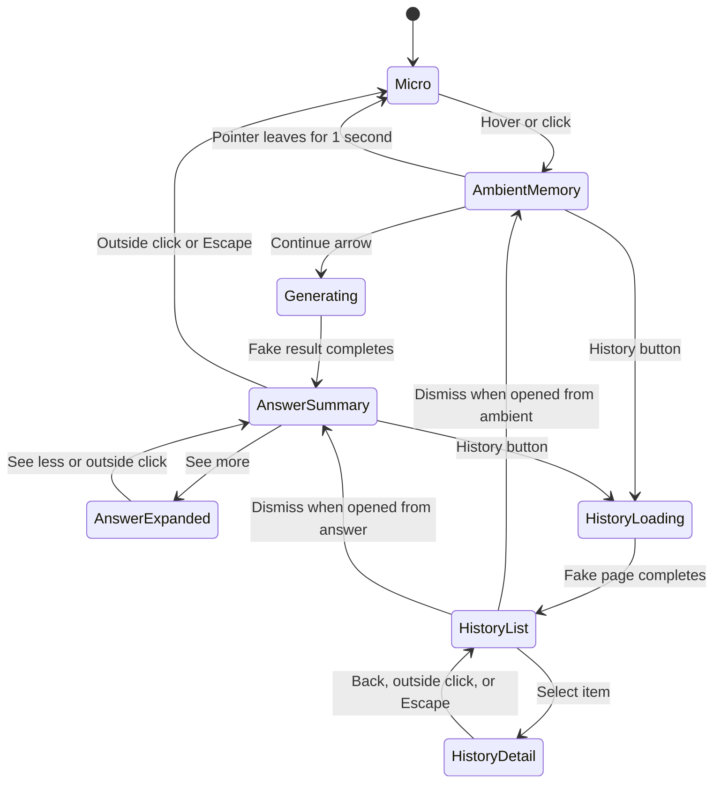

# React Website Replica — Current Smalltalk Island

**Status:** build contract for a visually faithful, fully simulated website component

**Source snapshot:** current working tree on 2026-07-22

**Native source of truth:** `src-tauri/macos/SessionIslandPanel.swift`

**Purpose:** give a website-building agent everything needed to recreate the current Smalltalk island in React without connecting to capture, SQLite, Tauri, Rust, screenshots, or a model.

---

## 1. The outcome

Build one polished React component that looks and behaves like the current native Smalltalk island.

The website version must simulate the complete product story:

1. A very small black resting notch.
2. A compact memory-status pill revealed by hover or click.
3. Fake memory start, active, pause, privacy, and error states.
4. A fake `Continue` request with the real generating treatment.
5. A compact answer that persists until dismissed.
6. An expanded answer with the same content hierarchy.
7. An optional fake visual-evidence card.
8. A fake, paginated Continue history.
9. One-level-at-a-time dismissal, keyboard access, reduced motion, and responsive viewport clamping.

This is a website demonstration. Every operation must be local and simulated. It must never ask for screen recording, inspect the user's browser, call an artificial-intelligence service, take a screenshot, read local files, or send product analytics.

## 2. Non-negotiable visual character

The island is a precise black hardware-like object, not a glassmorphism card and not a generic chatbot widget.

Preserve these qualities:

- Pure black surface.
- Thin, quiet charcoal outline.
- White primary text.
- Pale pink labels and text actions.
- Compact dimensions and tight spacing.
- Continuous capsule and rounded-card geometry.
- Motion that grows downward and outward from a stable top-center anchor.
- No visible rectangular host box around the island.
- No gradients.
- No blur or frosted glass.
- No broad shadow, glow, colored aura, or gray bounding rectangle.
- No logo, avatar, product name, sparkle icon, microphone, waveform, or chat bubble.
- No extra actions added because they seem useful.

The empty area around the visible capsule must be completely transparent.

## 3. Website placement

### Default placement

Render the component as a fixed overlay:

```css
position: fixed;
top: 4px;
left: 50%;
transform: translateX(-50%);
z-index: 1000;
```

The top-center point is the visual anchor. When the component becomes wider or taller, it must expand equally left and right and only downward. It must not jump vertically between states.

### Optional showcase placement

The same component may accept `placement="inline"` for a landing-page hero or component gallery. Inline mode changes only the outer positioning. It must reuse the exact same island markup, dimensions, state machine, and styling.

Do not build separate fixed and hero versions.

### Dragging

The native island can be dragged. Reproduce this on desktop as a secondary behavior:

- The background of the live capsule may start a drag.
- Buttons, links, history rows, the history card, scroll areas, and scrollbars must not start a drag.
- Ignore movement below 4 pixels so clicks remain clicks.
- Clamp the island to 12 pixels inside the viewport.
- Preserve the current top-center anchor during every state change after dragging.
- Do not require dragging for the demo to work.
- On touch screens, omit dragging unless it can be implemented without interfering with taps and scrolling.

## 4. Exact visual tokens

Use these values as CSS custom properties. Do not approximate the three main colors.

```css
:root {
  --island-surface: #000000;
  --island-outline: #30302f;
  --island-accent: #f5bfef;
  --island-arrow-hover: #3a3a38;
  --island-white: #ffffff;

  --island-fast: 120ms;
  --island-history: 140ms;
  --island-morph: 180ms;
  --island-ease: cubic-bezier(0.23, 1, 0.32, 1);
  --island-continuity-ease: cubic-bezier(0.77, 0, 0.175, 1);
}
```

Use this typography:

- Interface text: `-apple-system, BlinkMacSystemFont, "SF Pro Text", "Segoe UI", sans-serif`.
- Expanded answer title only: `Instrument Serif`, regular, 24 pixels.
- If the website can legally reuse the included font, copy `src-tauri/resources/fonts/InstrumentSerif-Regular.ttf` into the website's normal font asset location and define it with `@font-face`.
- If the font cannot be copied, use a restrained editorial serif fallback. Do not substitute a decorative display font.
- All dimensions in this document are CSS pixels. They correspond to the native point values at the current scale of `1.0`.

The component must inherit neither the website's button styles nor its heading margins. Apply a small local reset inside the island root.

```css
.smalltalk-island,
.smalltalk-island * {
  box-sizing: border-box;
}

.smalltalk-island button {
  appearance: none;
  border: 0;
  margin: 0;
  padding: 0;
  font: inherit;
}
```

## 5. Required state model

Keep presentation state separate from simulated memory state. Do not use a large set of unrelated booleans to decide which surface is visible.

```ts
type IslandPresentation =
  | "micro"
  | "ambientMemory"
  | "generating"
  | "answerSummary"
  | "answerExpanded"
  | "historyLoading"
  | "historyList"
  | "historyDetail";

type MemoryState =
  | "neverStarted"
  | "starting"
  | "active"
  | "pausing"
  | "paused"
  | "suppressed"
  | "error";

type AnswerRow = {
  label:
    | "Current activity"
    | "Last checkpoint"
    | "Continue from here"
    | "Return to";
  value: string;
};

type IslandAnswer = {
  id: string;
  title: string;
  createdAt: number;
  rows: AnswerRow[];
  visualCueSrc?: string;
};

type IslandState = {
  presentation: IslandPresentation;
  memory: MemoryState;
  continueInFlight: boolean;
  answer: IslandAnswer | null;
  visualCueVisible: boolean;
  historyOrigin: "ambientMemory" | "answerSummary";
  selectedHistoryId: string | null;
};
```

Recommended component boundaries:

```text
SmalltalkIsland
├── LiveCapsule
│   ├── MicroNotch
│   ├── AmbientMemoryPill
│   │   ├── DotMatrix
│   │   ├── StatusCopy
│   │   └── ContinueArrow
│   ├── AnswerSummary
│   └── AnswerExpanded
│       └── VisualCueCard
├── HistoryButton
└── HistoryCard
    ├── HistoryLoading
    ├── HistoryList
    └── HistoryDetail
```

Keep one outer island controller and one state machine. Child components should render state and emit semantic events such as `START_MEMORY`, `REQUEST_CONTINUE`, `SHOW_MORE`, and `DISMISS_ONE_LEVEL`.

## 6. Presentation flow



Rules:

- There is only one primary live capsule at a time.
- The current answer has no auto-dismiss timer.
- Hovering the answer summary does not expand it.
- A new Continue request is possible only after returning to the ambient arrow state.
- When Continue is running, a second request must be ignored.
- History is attached to the current island. Do not open a modal or a second floating window.
- Dismiss only one level per outside click or Escape press.

## 7. State-by-state visual specification

### 7.1 Micro resting notch

The micro state is the default resting shape.

| Property | Value |
| --- | ---: |
| Invisible layout panel | 187 × 49 |
| Visible shape | 58 × 10 |
| Interaction target | 86 × 24 |
| Visible radius | 5 |
| Border | 1 pixel `#30302f` |
| Fill | `#000000` |

The shape is aligned to the top of its transparent layout panel.

Behavior:

- Hovering the hit target reveals the ambient pill.
- Clicking it does the same thing, which is required for touch and keyboard users.
- If memory is active or starting, use an extremely restrained breathing pulse: scale from `1` to `1.018` and outline opacity from `0.72` to `1`, then reverse. One full cycle is 3.2 seconds.
- Do not pulse when reduced motion is enabled.
- The micro notch contains no visible text or icon.

### 7.2 Ambient memory pill

| Property | Normal value |
| --- | ---: |
| Invisible layout panel | 187 × 49 |
| Visible capsule | 168 × 34 |
| Left/right inner padding | 8 / 4 |
| Gap between status and arrow | 5 |
| Status region width | 123 |
| Dot matrix | 11 × 11 |
| Dot-to-label gap | 4 |
| Status label width | 108 |
| Main text | 12, semibold |
| Arrow button | 28 × 24 |
| Arrow icon | 11, semibold |

The ambient pill uses a `17px` capsule radius, which is most safely implemented as `border-radius: 999px`.

The content order is always:

```text
[5 × 5 dot matrix] [status text] [right arrow in a darker capsule]
```

Status copy must be exact:

| Simulated state | Visible copy |
| --- | --- |
| `neverStarted` | `Start memory` |
| `starting` | `Starting memory…` |
| `active` | `Capturing context` |
| `pausing` | `Pausing memory…` |
| `paused` | `Memory paused` |
| `suppressed` | `Not saving this app` |
| `error` | `Memory needs attention` |
| Continue request | `Generating answer…` |

When memory is inactive, the left status region is a button. Clicking it starts the fake memory flow. On hover, the matrix may switch to its restart pattern.

The right arrow:

- Uses a simple right-arrow icon, not a chevron inside another icon family.
- Is white on `#30302f`.
- Uses `#3a3a38` on hover.
- Has a subtle pressed scale of `0.96`.
- Has the accessible name `Show what I was doing` while memory is active.
- Has the accessible name `Start memory before generating an answer` while memory is inactive.
- Does not start or pause memory.

If the arrow is pressed while memory is inactive, do not generate an answer. Shake the whole live capsule horizontally and leave the state unchanged. Use these pixel offsets at 50-millisecond intervals:

```ts
[-10, 10, -10, 10, -10, 10, -10, 8, -8, 0]
```

For reduced motion use `[-2, 2, 0]` at 60-millisecond intervals.

### 7.3 Start and pause transition notification

Starting and pausing use the larger notification geometry for three seconds.

| Property | Value |
| --- | ---: |
| Invisible layout panel | 255 × 61 |
| Visible capsule | 236 × 46 |
| Left/right inner padding | 10 / 6 |
| Gap between status and arrow | 7 |
| Status region width | 175 |
| Dot matrix | 13 × 13 |
| Dot-to-label gap | 5 |
| Status label width | 156 |
| Main text | 14, semibold |
| Arrow region | 32 × 28 |
| Bottom countdown line | 2 high |

Add a white line at the bottom of the capsule at `0.88` opacity. It begins at full width and drains linearly to zero over three seconds from left to right.

For the website simulation:

- `Start memory` → `starting` immediately.
- Change `starting` to `active` after about 600 milliseconds, but keep the large notification shell and countdown line until three seconds have elapsed.
- At three seconds, return to the micro state.
- The island itself does not currently expose a pause button. A development-only demo panel may trigger `pausing` → `paused` so the website team can test that appearance. Do not add a pause control to the visible island.

### 7.4 Generating answer

Generating begins immediately after a valid arrow press.

| Property | Value |
| --- | ---: |
| Invisible layout panel | 255 × 61 |
| Visible capsule | 236 × 46 |
| Copy | `Generating answer…` |
| Dot matrix | 13 × 13 |

During generation:

- Remove the arrow itself but preserve a clear `32 × 28` space so the text and matrix do not shift.
- Ignore repeated Continue requests.
- Do not allow memory-status updates to replace this presentation.
- Run the fake request for a deterministic 1.2 to 1.6 seconds. A fixed value is preferred for screenshot testing.
- On completion, create a new history record and show the compact answer.

### 7.5 Compact answer

| Property | Value |
| --- | ---: |
| Visible height | exactly 30 |
| Invisible layout height | exactly 49 |
| Minimum visible width | 152 |
| Horizontal padding | 10 on each side |
| Gap between title and action | 2 |
| Text | 12, semibold |
| Shape | capsule |

Content order:

```text
[one-line answer title] [See more]
```

- The title is white.
- `See more` is `#f5bfef`.
- Measure the content and allow the pill to grow horizontally.
- Clip the title with an ellipsis only when the viewport cannot fit the natural width.
- Keep `See more` visible.
- The accessible label must contain the complete title even if the visual line is clipped.
- There is no timeout and no hover expansion.
- Clicking outside returns to micro.

Width calculation:

```ts
summaryWidth = clamp(
  measuredTitleWidth + measuredSeeMoreWidth + 2 + 20 + 20,
  152,
  viewportWidth - 67
);
```

The final `20` is a safety allowance used by the native measurement. Preserve it unless screenshot comparison proves it unnecessary in the browser font renderer.

### 7.6 Expanded answer

The expanded answer is a rounded black card, not a speech bubble.

| Property | Value |
| --- | ---: |
| Width | content-driven, 320–640 |
| Minimum height | 104 |
| Maximum combined height | 70% of viewport height |
| Horizontal padding | 24 |
| Vertical padding | 20 |
| Card radius | 24 |
| Border | 1 pixel `#30302f` |
| Title-to-body gap | 18 |
| Row-to-row gap | 14 |
| Label-to-value gap | 5 |

Header:

- Answer title: Instrument Serif, 24, regular, white.
- Optional `Visual cue` pill: 11, semibold, pink.
- `See less`: 12, semibold, pink.
- Keep both actions visible. The title may wrap.

Render only non-empty rows and preserve this exact order:

1. `Current activity`
2. `Last checkpoint`
3. `Continue from here`
4. `Return to`

Row typography:

| Row | Value typography | Value color |
| --- | --- | --- |
| Current activity | 14, regular | white at 0.88 opacity |
| Last checkpoint | 16, semibold | white at 0.96 opacity |
| Continue from here | 17, semibold | solid white |
| Return to | 14, regular | white at 0.88 opacity |

All row labels are 11, semibold, `#f5bfef`. Values use 3 pixels of extra line spacing.

Long content scrolls inside the answer card. Do not truncate it. The card itself remains within the 70-percent viewport cap.

`See less` returns to the compact answer. An outside click or Escape does the same. It must not collapse from expanded directly to micro.

### 7.7 Visual cue

The visual cue is optional and starts hidden.

The button appears only when the current fake answer has a valid local demo-image URL. Clicking it attaches a second card eight pixels below the expanded answer.

| Property | Value |
| --- | ---: |
| Gap below answer | 8 |
| Card width | same as answer |
| Card radius | 18 |
| Card padding | 12 |
| Title | `Visual cue`, 11 semibold pink |
| Title-to-image gap | 8 |
| Image radius | 12 |
| Maximum image height | 220 |
| Image fit | `object-fit: contain` |

Use a checked-in marketing demo image or a purpose-made placeholder. Do not capture the current browser tab or desktop.

When the cue is visible, reduce its image height before allowing the answer card to become shorter than 104 pixels. The answer text scrolls inside the upper card; the cue stays fixed below it.

Toggling the cue changes opacity and lets the outer shell morph over 180 milliseconds. `See less` and outside-click dismissal hide it.

### 7.8 History button

Show the history control only beside:

- The ambient memory pill when no start/pause countdown or Continue request is active.
- The compact current answer.
- An open history surface, so it can close history.

Hide it in micro, generating, transition notification, expanded answer, and visual-cue presentations.

| Property | Value |
| --- | ---: |
| Visible circle | 30 × 30 |
| Hit target | 40 × 40 |
| Visual gap from capsule | 8 |
| Icon | history/clock with circular arrow, 13 semibold |
| Fill | black |
| Border | 1 pixel `#30302f` |

Use a Lucide `History` or equivalent outline icon if the native symbol is unavailable. The final shape should read as a clock with a circular arrow, not as a generic counterclockwise arrow.

The button normally appears on the left. Move it to the right only if its 40-pixel target would leave the viewport.

Accessible name and tooltip: `Continue history`.

### 7.9 History card

The history card is attached eight pixels below the live capsule inside the same component layer.

| Property | Value |
| --- | ---: |
| Preferred width | 360 |
| Width range | 320–380 |
| Maximum height | 60% of viewport height |
| Radius | 24 |
| Header height | 54 |
| Minimum row height | 58 |
| Border | 1 pixel `#30302f` |

The live capsule remains visible and unchanged above history. The card must not look like a centered modal.

#### Loading

- Heading: `History`.
- Right header label: `Latest 100`.
- Four quiet skeleton rows.
- Primary skeleton bars use white at `0.12` opacity.
- Secondary skeleton bars use white at `0.07` opacity.
- No shimmer is required.

#### Empty

- Clock-history icon.
- `No previous answers yet`.
- `Use Continue to create one`.

#### Error

- `History unavailable`.
- Short fake error text.
- Pink `Retry` action.

#### List

- Return newest items first.
- Fake the first page as up to 25 items.
- Keep at most 100 unique answer IDs.
- Each row shows the exact title, up to two lines.
- Show a relative time below the title.
- Put the full local date and time in the tooltip and accessible label.
- Mark the live answer with a restrained pink `Current` chip.
- Otherwise show a faint right chevron.
- Use a 1-pixel row divider beginning 18 pixels from the left.
- Show `Load older answers` only when another fake page exists.

#### Detail

- Header left: pink `Back` action.
- Header right: `Past answer · <local date and time>`.
- Use the same title, labels, values, order, spacing, and type emphasis as the current expanded answer.
- Historical detail is read-only.
- Do not show Visual cue, regeneration, opening, feedback, deletion, search, or export.

History list/detail transitions use opacity plus a top-anchored scale from `0.97` to `1` over 140 milliseconds. Do not bounce or stagger rows.

## 8. Dot-matrix specification

Build the status indicator as a 5 × 5 grid of circular white dots.

- Dot diameter is `14.5%` of the matrix side.
- Distribute the remaining room evenly as four gaps.
- Inactive dot opacity: `0.15`.
- Active dot opacity: `0.82`.
- Index dots from 0 to 24 in row-major order.

Static patterns:

```ts
const ACTIVE = new Set([7, 11, 12, 13, 17]);
const PAUSED = new Set([6, 8, 11, 13, 16, 18]);
const SUPPRESSED = new Set([1, 3, 5, 9, 10, 14, 16, 18, 22]);
const ERROR = new Set([2, 7, 12, 22]);
const GENERATING_STATIC = new Set([2, 3, 4, 9, 14]);
const RESTART_HOVER = new Set([1, 6, 7, 11, 12, 13, 16, 17, 21]);
```

Map states as follows:

- `active` and `starting` → `ACTIVE`.
- `pausing`, `paused`, and `neverStarted` → `PAUSED`.
- `suppressed` → `SUPPRESSED`.
- `error` → `ERROR`.
- `generating` → `GENERATING_STATIC` plus the chase animation.
- Hover over the inactive Start-memory region → `RESTART_HOVER`.

### Generating chase

Animate one bright point clockwise around this perimeter order:

```ts
const GENERATING_PERIMETER = [
  20, 21, 22, 23, 24, 19, 14, 9,
  4, 3, 2, 1, 0, 5, 10, 15,
];
```

One loop lasts 820 milliseconds. Each perimeter dot moves through these opacity stages:

```text
0.15 → 0.15 → 1.0 → 0.42 → 0.15
```

Use phase offsets to create one continuous clockwise chase. With reduced motion, stop the chase and show only the static generating pattern.

### Fake capture pulse

While memory is active, trigger a fake capture pulse every 4 to 6 seconds. Use a deterministic interval in automated tests.

For 720 milliseconds, pull all dots 32 percent of the distance toward the center, brighten them, and return them to rest. Do not trigger pulses more frequently than once every 1.75 seconds.

With reduced motion, leave positions fixed and pulse only the center dot's opacity for 400 milliseconds.

## 9. Motion contract

Main morph:

```css
transition:
  width 180ms cubic-bezier(0.23, 1, 0.32, 1),
  height 180ms cubic-bezier(0.23, 1, 0.32, 1),
  border-radius 180ms cubic-bezier(0.23, 1, 0.32, 1),
  transform 180ms cubic-bezier(0.23, 1, 0.32, 1),
  opacity 120ms ease-out;
```

Micro-to-ambient uses the same 180-millisecond duration with `cubic-bezier(0.77, 0, 0.175, 1)` for width and height. Fade ambient contents in over 120 milliseconds with a 40-millisecond delay. Fade them out over 100 milliseconds without a delay.

All scale transitions use `transform-origin: top center`.

Reduced motion:

- Disable breathing, positional dot motion, and chasing.
- Replace scale/movement transitions with a 120-millisecond opacity fade or an immediate state change.
- Preserve every interaction and all text.
- Respect both `prefers-reduced-motion: reduce` and a component-level test override.

## 10. Fake behavior implementation

The simulation must feel complete while remaining deterministic and harmless.

### Suggested mock timings

```ts
export const MOCK_TIMING = {
  startFeedbackMs: 600,
  transitionShellMs: 3000,
  continueRequestMs: 1400,
  historyPageMs: 550,
  historyDetailMs: 350,
  ambientReturnMs: 1000,
  capturePulseMs: 5000,
};
```

### Suggested current answer

```ts
export const DEMO_ANSWER: IslandAnswer = {
  id: "demo-current",
  createdAt: Date.now(),
  title: "Build the Smalltalk website and preserve the accepted visual direction",
  rows: [
    {
      label: "Current activity",
      value:
        "You were refining the website implementation brief and checking how the product story should move between sections.",
    },
    {
      label: "Last checkpoint",
      value:
        "The page structure and core visual references were agreed, with final transition behavior still being specified.",
    },
    {
      label: "Continue from here",
      value:
        "Implement the island demo as one React state machine, then compare every state at the target dimensions.",
    },
    {
      label: "Return to",
      value: "Website implementation · island component",
    },
  ],
  visualCueSrc: "/demo/island-visual-cue.webp",
};
```

Provide at least four additional fake history items. Include short and long titles so truncation and detail layout are both exercised.

### Local persistence

It is acceptable to store fake history in `localStorage` under a clearly demo-only key such as:

```text
smalltalk.website-island-demo.history.v1
```

The component must still work when storage is unavailable. Storage errors should silently fall back to in-memory history.

Do not store any real page content, browsing activity, typed text, or user data.

### Development-only state controls

Create a small demo harness for the website team, but keep it outside the island and remove or hide it in the production landing page.

The harness may trigger:

- Micro.
- Memory active.
- Memory paused.
- Privacy-suppressed.
- Memory error.
- Generating.
- Short answer.
- Long answer.
- Empty history.
- History error.

This is the correct way to make every state testable. Do not add these controls to the island itself.

## 11. Outside click and keyboard behavior

Attach outside-click handling only while summary, expanded answer, or history is open.

Ignore clicks inside the island root, including the detached history button and attached history card.

Dismissal rules:

| Current presentation | Outside click or Escape |
| --- | --- |
| `answerExpanded` | `answerSummary` |
| `answerSummary` | `micro` |
| `historyDetail` | `historyList` |
| `historyList` or `historyLoading` | exact history origin |
| `micro`, `ambientMemory`, `generating` | no outside-click action |

Pressing the history button while history is open closes the whole history surface directly and restores its origin.

When history opens, move keyboard focus to the `History` heading. When it closes, return focus to the history button. When detail opens, focus the Back control or detail heading.

## 12. Accessibility

Required behavior:

- All actions must be real `<button type="button">` elements.
- The micro hit target must have an accessible name such as `Show Smalltalk` or `Smalltalk memory is active`.
- The matrix is decorative and uses `aria-hidden="true"`.
- Generating copy should use `role="status"` or a polite live region.
- The compact answer's accessible name contains the full title plus `See more`.
- Expanded title uses a real heading.
- Every answer label and value remains readable in source order.
- `Visual cue` announces whether it will show or hide the image.
- The demo image alt text is `Full-screen evidence used for this answer`.
- History rows announce full title, full local date/time, and whether the item is current or past.
- Visible hit targets should be at least 40 × 40 where the native design already provides an invisible expanded target.
- Do not make the whole island one giant button.
- Do not rely on pink color alone to communicate current selection or state.

Keyboard minimum:

- Tab reaches Start memory, Continue, See more/less, Visual cue, History, Retry, Load older, Back, and history rows.
- Enter and Space activate buttons.
- Escape dismisses one presentation level.
- Focus rings must be visible but visually restrained. Use a 2-pixel pink outline with a 2-pixel offset for keyboard focus only.

## 13. Responsive rules

Desktop dimensions above are the fidelity target.

For narrow viewports:

- Keep 12 pixels of viewport margin.
- Expanded width becomes `min(640px, max(320px, calc(100vw - 24px)))` where possible.
- Below 344 pixels, allow the expanded card and history card to use `calc(100vw - 24px)` rather than forcing horizontal overflow.
- Compact answer keeps `See more` visible and truncates only the title.
- History button flips sides when needed.
- Expanded answer and history use internal vertical scrolling.
- The combined answer plus visual cue remains no taller than `70dvh`.
- The history card remains no taller than `60dvh`.
- Tapping the micro notch replaces hover on touch devices.

Do not redesign the island into a bottom sheet on mobile. This component is a website representation of the desktop product.

## 14. Suggested file structure

Adapt names to the website's existing conventions. Do not install a state-management library for this component.

```text
src/components/smalltalk-island/
├── SmalltalkIsland.tsx
├── SmalltalkIsland.css
├── DotMatrix.tsx
├── islandReducer.ts
├── islandFixtures.ts
├── useOutsideDismiss.ts
├── useIslandDrag.ts
├── SmalltalkIslandDemo.tsx
└── SmalltalkIsland.test.tsx
```

Use the website's existing icon package if it already has suitable arrow, history, and chevron icons. Do not add an icon dependency solely for three simple symbols unless hand-authored accessible SVGs would be harder to maintain.

## 15. Acceptance tests

### Behavior

- [ ] Initial render shows only the 58 × 10 micro notch.
- [ ] Hover and click both reveal the 168 × 34 ambient pill.
- [ ] Leaving ambient returns to micro after one second.
- [ ] Start memory shows the larger three-second transition shell and draining line.
- [ ] Pressing Continue while inactive shakes and does not generate.
- [ ] Pressing Continue while active immediately shows `Generating answer…`.
- [ ] The arrow cannot dispatch a second fake request while generating.
- [ ] The fake result becomes a persistent compact answer.
- [ ] `See more` opens the expanded answer with four rows in the correct order.
- [ ] `See less` returns to compact.
- [ ] Visual cue is absent when no demo image exists.
- [ ] Visual cue is opt-in and starts hidden when an image exists.
- [ ] History opens from ambient and compact answer only.
- [ ] History list, loading, empty, error, pagination, and detail states are testable.
- [ ] Dismissal happens one level at a time.
- [ ] Reduced motion preserves behavior while removing positional motion.
- [ ] No operation accesses real user data or the network.

### Visual

- [ ] Surface is exactly black and outline is exactly `#30302f`.
- [ ] Accent is exactly `#f5bfef`.
- [ ] There is no rectangular halo around the component.
- [ ] There are no gradients, glass blur, or broad shadows.
- [ ] Every state preserves the top-center anchor.
- [ ] Micro, ambient, generating, summary, expanded, cue, and history dimensions match this document.
- [ ] Expanded title uses Instrument Serif or the approved fallback.
- [ ] Current activity is visually quieter than Last checkpoint.
- [ ] Continue from here is the strongest body row.
- [ ] Long answer text scrolls and is never silently removed.
- [ ] Long compact titles truncate without hiding `See more`.

### Required screenshots

Capture these at a desktop viewport before calling the component complete:

1. Micro resting notch.
2. Ambient active memory pill.
3. Generating notification.
4. Compact answer plus detached history button.
5. Expanded answer.
6. Expanded answer with visual cue.
7. History list.
8. Historical detail.

Also capture the compact answer and expanded answer at one narrow mobile viewport to confirm clamping rather than to redesign the component.

## 16. Explicitly out of scope

Do not implement any of the following:

- Screen recording or screenshot capture.
- Browser history inspection.
- Accessibility-tree capture.
- Text extraction from the page.
- Tauri commands.
- Rust or Swift code.
- SQLite.
- OpenAI or any other model request.
- Real target opening.
- Feedback or correction APIs.
- Authentication.
- Analytics for island content.
- A backend history service.
- Search, export, delete, or settings inside the island.
- A chat input.
- A stop-memory button added to the island.

The fake website component should communicate the real product interaction without pretending that the website is actually observing the user.

## 17. Definition of done

The work is complete only when:

1. One reusable React component implements the entire state flow.
2. All fake effects are local, deterministic, and safe.
3. The dimensions, color, type hierarchy, and top-anchored morph match this document.
4. Every required state is reachable through the component or development-only harness.
5. Keyboard, outside-click, focus-return, and reduced-motion behavior work.
6. The production build and component tests pass.
7. The required screenshots have been compared side by side and obvious visual differences have been corrected.

Passing TypeScript or tests alone is not visual acceptance. The component must be inspected in the real website at desktop and narrow viewport sizes.
